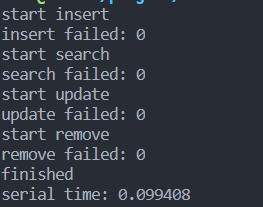
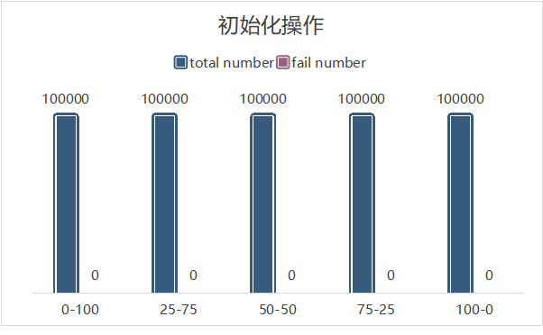
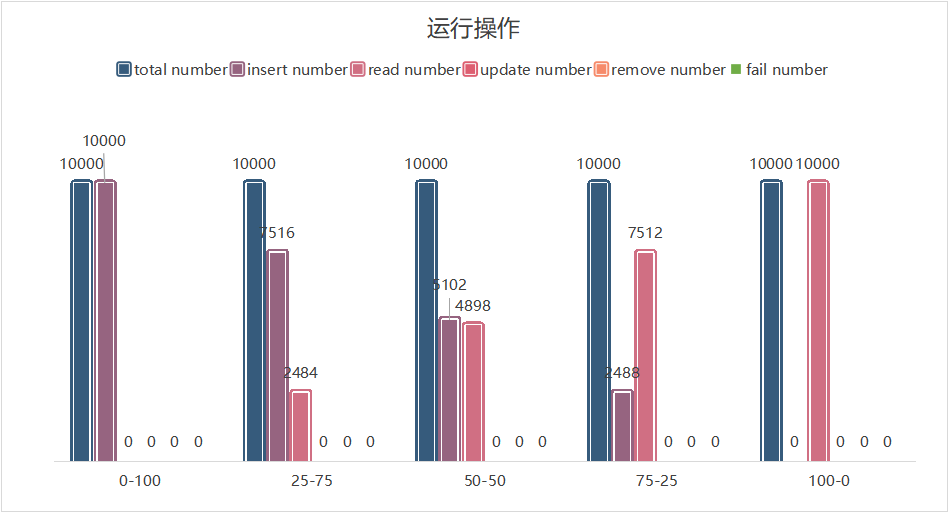

# 2020-Fall-DBMS-Project

授课老师：冯剑琳

小组成员与分工：

- 王乐天：环境配置，Git统筹，基础功能实现，代码调试
- 曾蠡：基础功能实现，回收功能实现
- 柒思远：基础功能实现，回收功能实现
- 彭威：正确性测试，YCSB测试，文档框架

## 1. 项目概述

本项目实现了一个**线性哈希**索引的简单数据库，在实现高效增删查改的同时可持久化到模拟的 NVM 硬件上。

本项目使用了 Intel 的 PMDK 库进行开发，在一个定长页表上进行空间管理，为线性哈希的数据库分配和回收空间，并使用 PMDK 库封装的函数进行地址映射与持久化操作。

## 2. 环境配置

由于 Ubuntu 18.04 LTS 通过 `apt` 安装的前置依赖版本不满足 `pmdk` 库构建的最低要求，故本项目使用了 Ubuntu 20.04 LTS 虚拟机作为开发环境。

### 2.1 NVM环境模拟

根据 Intel 提供的教程进行配置，步骤如下：（root用户下配置）

1. 通过 `dmesg | grep BIOS-e820` 查看可申请的内存地址，发现在4G位置后有1G空余的内存可供申请
2. 配置 `/etc/default/grub` ，`GRUB_CMDLINE_LINUX="memmap=1G!4G"`
3. 通过 `grub-mkconfig -o /boot/grub/grub.cfg` 重新生成引导文件
4. 重启系统，使用 `ls /dev |grep pmem` 检验是否申请成功，并通过以下命令格式化和挂载模拟的 NVM：

```sh
# mkdir /mnt/pmemdir
# mkfs.ext4 /dev/pmem0
# mount -o dax /dev/pmem0 /mnt/pmemdir
```

以上步骤完成后，可通过 mmap 时传入 `pmem_map_file()` 的参数 `is_pmem` 检验是否模拟成功。经检验，以上步骤在 `Ubuntu 20.04 LTS` 下可以成功模拟 NVM 环境。

### 2.2 PMDK库配置

本项目实现了利用 `Github Action` 自动测试构建，详见 `.github/workflows/cmake.yml` 文件。

1. 前置依赖安装

```shell
$ sudo apt-get install -y git autoconf pkg-config libndctl-dev libdaxctl-dev pandoc libfabric-dev
```

2. PMDK 库安装

```shell
$ git clone https://github.com/pmem/pmdk.git && cd pmdk && git checkout tags/1.10 && sudo make install prefix=/usr/local
```

此外，Make, CMake 等其他必要的环境在项目 README 文档中可以找到。

## 3. 功能实现与代码展示

  本次实验的主体部分包含在 `pml_hash.cc` 和 `pml_hash.h` 两个文件当中。构建了整个底层部分，负责对数据的操作。  

### 3.1 数据结构

- 常量声明

```C++
#define TABLE_SIZE 16              // adjustable
#define HASH_SIZE 16               // adjustable
#define FILE_SIZE 1024 * 1024 * 16 // 16 MB adjustable
```

首先是关于数据库的一些定值的声明，TABLE_SIZE 是每一个哈希表的大小，HASH_SIZE 是定义的初始的HASH值，同时也代表最初的16张哈希表，FILE_SIZE 代表该数据库向NVM申请的空间大小。

- 元数据结构

```C++
typedef struct metadata
{
    size_t size;           // the size of whole hash table array
    size_t level;          // level of hash
    uint64_t next;         // the index of the next split hash table
    uint64_t overflow_num; // amount of overflow hash tables
    uint64_t total;        // the number of total elements
    uint64_t index;        // the index of the first free overflow bucket;
} metadata;
```

该结构的功能主要是用来存储整个线性哈希的**元数据**，`size` 代表非溢出哈希表的数组长度，`level` 代表哈希分裂的轮数（从第0轮开始算），`next` 代表下一次分裂的表，`overflow_num` 代表溢出表的总数，`total` 代表目前数据库中中总共有多少个元素，`index` 代表下一个空溢出表的下标。

- 键值对结构

```C++
typedef struct entry
{
    uint64_t key;
    uint64_t value;
} entry;
```

该结构为哈希表中的键值。

- 哈希表（桶）结构

```C++
typedef struct pm_table
{
    entry kv_arr[TABLE_SIZE]; // data entry array of hash table
    uint64_t fill_num;        // amount of occupied slots in kv_arr
    uint64_t next_offset;     // the file address of overflow hash table
    uint64_t pm_flag;         // 1 -- occupied, 0 -- available
} pm_table;
```

这个部分代表的是哈希表的数据结构，其中 `kv_arr[TABLE_SIZE]` 为存储键值对的数组，而 `fill_num` 代表此哈希表内有多少个元素，`next_offset` 为溢出表的位置，`pm_flag` 是溢出表空间回收的相关变量，用来辨别表是否为空闲，空闲为0，被占用为1。

### 3.2 **PMLHash类**的实现

类的声明如下：

```C++
class PMLHash
{
private:
    void *start_addr;    // the start address of mapped file
    void *overflow_addr; // the start address of overflow table array
    metadata *meta;      // virtual address of metadata
    pm_table *table_arr; // virtual address of hash table array
    pm_table *overflow_arr; // virtual address of overflow table array

    int insert_bucket(pm_table *addr, entry en);
    int split();
    uint64_t hashFunc(const uint64_t &key, const size_t &hash_size);
    pm_table *newOverflowTable(uint64_t &offset);
    pm_table *find_first_free_table();

public:
    PMLHash() = delete;
    PMLHash(const char *file_path);
    ~PMLHash();

    int insert(const uint64_t &key, const uint64_t &value);
    int search(const uint64_t &key, uint64_t &value);
    int remove(const uint64_t &key);
    int update(const uint64_t &key, const uint64_t &value);
};
```

#### 私有成员变量

```C++
void *start_addr;        //指向映射文件的虚拟地址开始位置
void *overflow_addr;     //指向溢出表空间的虚拟地址起始位置
pm_table *table_arr;     //指向哈希表的起始地址
pm_table *overflow_arr;  //指向溢出哈希表的起始位置
```

#### 私有成员函数

- 插入指定桶

```C++
int PMLHash::insert_bucket(pm_table *addr, entry en)
{
    pm_table *table = addr;
    while (table->next_offset != 0)
    {
        table = (pm_table *)table->next_offset;
    }
    if (table->fill_num >= 16)
    {
        table->next_offset = (uint64_t)(find_first_free_table());
        pmem_persist((void *)table, sizeof(pm_table));
        meta->overflow_num++;
        pmem_persist(start_addr, sizeof(metadata));
        table = (pm_table *)table->next_offset;
        table->pm_flag = 1;
        table->fill_num = 0;
        table->next_offset = 0;
    }
    table->kv_arr[table->fill_num] = en;
    table->fill_num++;
    pmem_persist((void *)table, sizeof(pm_table));
    return 0;
}
```

该函数用于在找到对应的哈希表之后将元素插入到这个哈希表或者其溢出表。

在到达该哈希表链上的最后一个表后，需要判断哈希表是否满了，如果表满了，就使用 `find_first_free_table()` 函数生成一个溢出表并将元素插入新表，否则插入最后这一个表。

- 哈希函数

```C++
uint64_t PMLHash::hashFunc(const uint64_t &key, const size_t &hash_size)
{
    return (key * 3) % hash_size;
}
```

通过key和当前的hash大小来找到对应的表，hash_size随着表分裂的轮数增加而变大。

- 寻找空闲桶

```C++
pm_table * PMLHash::find_first_free_table(){
    for(uint64_t i = 0; i <= meta->overflow_num; i++) {
        if(overflow_arr[i].pm_flag == 0) 
           return &overflow_arr[i];
    }
    if(meta->overflow_num + 1 >= (FILE_SIZE / 2) / sizeof(pm_table)) {
        perror("No available overflow table");
        exit(1);
    }
    return &overflow_arr[meta->overflow_num + 1];
}
```

该函数通过遍历前 `overflow_num + 1` 个溢出表，找到可以使用的空表并返回其地址。

- 分裂

```C++
int PMLHash::split()
{
    // fill the split table
    vector<entry> temp_arr;
    int hash_num = (1 << meta->level) * HASH_SIZE * 2;
    pm_table *split_table = &table_arr[meta->next];
    while (true)
    {
        for (uint64_t i = 0; i < split_table->fill_num; i++)
        {
            uint64_t hash_value = hashFunc(split_table->kv_arr[i].key, hash_num);
            // move to the new table
            if (hash_value != meta->next)
            {
                pm_table *new_table = &table_arr[hash_value];
                if ((uint64_t)new_table + sizeof(pm_table) > (uint64_t)start_addr + FILE_SIZE/2)
                    return -1;
                entry en = {
                    key : split_table->kv_arr[i].key,
                    value : split_table->kv_arr[i].value
                };
                insert_bucket(new_table, en);
            }
            // stay in the old table, move to temp_arr first
            else
            {
                entry en = {
                    key : split_table->kv_arr[i].key,
                    value : split_table->kv_arr[i].value
                };
                temp_arr.push_back(en);
            }
        }
        if (split_table->next_offset == 0)
            break;
        split_table = (pm_table *)(split_table->next_offset);
    }
    //fill old table
    split_table = &table_arr[meta->next];
    split_table->fill_num = 0;
    for (size_t i = 0; i < temp_arr.size(); i++)
    {
        if (split_table->fill_num >= 16)
        {
            pmem_persist((void *)split_table, sizeof(pm_table));
            split_table = (pm_table *)split_table->next_offset;
            split_table->fill_num = 0;
        }
        split_table->kv_arr[split_table->fill_num++] = temp_arr[i];
    }
    pmem_persist((void *)split_table, sizeof(pm_table));
    vector<uint64_t> stk;
    while (split_table->next_offset != 0)
    {
        stk.push_back(split_table->next_offset);
        uint64_t offset = split_table->next_offset;
        split_table->next_offset = 0;
        pmem_persist((void *)split_table, sizeof(pm_table));
        split_table = (pm_table *)offset;
    }
    for (size_t i = 0; i < stk.size(); i++)
    {
        pm_table *p = (pm_table *)stk[i];
        p->pm_flag = 0;
        pmem_persist((void *)p, sizeof(pm_table));
        meta->overflow_num--;
    }
    meta->next++;
    meta->size++;
    if (meta->next == (uint64_t)((1 << meta->level) * HASH_SIZE))
    {
        meta->next = 0;
        meta->level++;
    }
    pmem_persist(start_addr, sizeof(metadata));
    return 0;
}
```

该函数在负载因子 `((double)(meta->total) / (double)(TABLE_SIZE * meta->size)` 大于0.9的情况下触发，使用**轮询**的方式来进行分裂。

`meta->next` 代表的是下一个要被分裂的表。在进行分裂时，计算出这个表中元素将要被分裂到的两个表的下标（包括原来所在的该表以及一个新的表），将分到新表的元素插入到新表当中，而将要保留在原来这个表的元素先压入到一个 `temp_arr` 的 `vector` 当中，同时将原来这个表的溢出桶全部释放，即将 pm_flag 置0，`next_offset` 置0，再使用 `insert_bucket` 函数来插入到哈希表中。

#### 公有成员函数

- 插入

```C++
int PMLHash::insert(const uint64_t &key, const uint64_t &value)
{
    uint64_t hash_value = hashFunc(key, (1 << meta->level) * HASH_SIZE);
    if (hash_value < meta->next)
        hash_value = hashFunc(key, (1 << meta->level) * HASH_SIZE * 2);
    pm_table *table = table_arr + hash_value;
    entry en{
        key : key,
        value : value
    };
    meta->total++;
    int flag = insert_bucket(table, en);
    if ((double)(meta->total) / (double)(TABLE_SIZE * meta->size) > 0.9)
        split();
    return flag;
}
```

插入的操作是首先找到插入的表的位置，由于可能已经分裂过一次了，所以需要比较hash值和下一个要分裂的表的下标，**如果小于下标则是已经分裂过了，要用更新后的hash_size来重新确定这一个元素应该插入的表**，否则仍然插入原来计算出的hash值对应的表，在找到了要插入的表之后调用insert_bucket函数，再判断负载因子 `((double)(meta->total) / (double)(TABLE_SIZE * meta->size)` 是否大于0.9，大于则触发分裂操作。

- 删除

```C++
int PMLHash::remove(const uint64_t &key)
{
    uint64_t hash_value = hashFunc(key, (1 << meta->level) * HASH_SIZE);
    if (hash_value < meta->next)
        hash_value = hashFunc(key, (1 << meta->level) * HASH_SIZE * 2);
    pm_table *p = &table_arr[hash_value];
    pm_table *temp, *previous_table;
    int tag;
    while (true)
    {
        for (uint64_t i = 0; i < p->fill_num; i++)
        {
            if (p->kv_arr[i].key == key)
            {
                //move the last element to the tag place, and the total of elements substract 1;
                temp = p;
                //move to the last pm_table
                while (p->next_offset)
                {
                    previous_table = p;
                    p = (pm_table *)p->next_offset;
                }
                //move the last element to the tagged place, and the last pm_table delete the last one element
                temp->kv_arr[i].key = p->kv_arr[p->fill_num - 1].key;
                temp->kv_arr[i].value = p->kv_arr[p->fill_num - 1].value;
                pmem_persist((void *)temp, sizeof(pm_table));
                p->fill_num--;
                meta->total--;
                //the last pm_table is empty and need to be removed
                if (p->fill_num == 0)
                {
                    if ((uint64_t)p >= (uint64_t)overflow_addr)
                        meta->overflow_num--;
                    meta->total--;
                    previous_table->next_offset = 0;
                    pmem_persist((void *)previous_table, sizeof(pm_table));
                    p->pm_flag = 0;
                }
                pmem_persist((void *)p, sizeof(pm_table));
                pmem_persist(start_addr, sizeof(metadata));
                return 0;
            }
        }
        if (p->next_offset == 0)
            break;
        previous_table = p;
        p = (pm_table *)p->next_offset;
    }
    return -1;
}
```

删除的操作与插入的思路类似。首先用前面提到的方法确定要被删除的元素会存放在哪一张表内，然后遍历该表和它的溢出表进行查找。如果找到了要被删除的元素就记录该元素的位置，然后取出最后一张表的最后一个元素来填充到前面寻找到的元素的位置并使最后一张表的 `fill_num--`，同时检验最后一张表是否为空；如果为空，则将上一张表的 `next_offset` 设为0，最后一个桶的 `pm_flag` 设为0，如果该表为溢出表则将该表释放。返回0代表已经删除了目标元素，如果没有找到要被删除的元素则返回-1。

- 查询

```C++
int PMLHash::search(const uint64_t &key, uint64_t &value)
{
    uint64_t hash_value = hashFunc(key, (1 << meta->level) * HASH_SIZE);
    if (hash_value < meta->next)
        hash_value = hashFunc(key, (1 << meta->level) * HASH_SIZE * 2);
    pm_table *p = &table_arr[hash_value];
    while (true)
    {
        //search the temp pm_table;
        for (uint64_t i = 0; i < p->fill_num; i++)
        {
            if (p->kv_arr[i].key == key)
            {
                value = p->kv_arr[i].value;
                return 0;
            }
        }
        //if this table is full-filled, switch to the next_offset
        if (p->next_offset)
            p = (pm_table *)p->next_offset;
        //else break the loop
        else
            break;
    }
    return -1;
}
```

查询也是类似思路，获取对应哈希值之后遍历目标哈希表及其溢出表，找到要查找的元素则返回0，没有找到返回-1。

- 更新

```C++
int PMLHash::update(const uint64_t &key, const uint64_t &value)
{
    uint64_t hash_value = hashFunc(key, (1 << meta->level) * HASH_SIZE);
    if (hash_value < meta->next)
        hash_value = hashFunc(key, (1 << meta->level) * HASH_SIZE * 2);
    pm_table *p = &table_arr[hash_value];
    while (true)
    {
        //search the temp pm_table;
        for (uint64_t i = 0; i < p->fill_num; i++)
        {
            if (p->kv_arr[i].key == key)
            {
                p->kv_arr[i].value = value;
                pmem_persist((void *)p, sizeof(pm_table));
                return 0;
            }
        }
        //if this table is full-filled, switch to the next_offset
        if (p->next_offset)
            p = (pm_table *)p->next_offset;
        //else break the loop
        else
            break;
    }
    return -1;
}
```

更新与查询的思路相似，可以说更新功能是查询功能的升级。更新函数通过相同的方法寻找目标元素，在找到元素以后更新该元素的值。

## 4. 附加功能实现说明

本次的附加功能主要为溢出桶空间回收以及多线程实现。

### 4.1 溢出桶空间回收

我们实现了溢出桶空间回收的功能，在remove和insert等函数当中通过操作pm_table结构中的pm_flag变量来控制溢出哈希表的状态，当pm_flag为0时，此溢出哈希表处于空闲状态，而pm_flag为1时，此溢出哈希表处于占用状态。

同时为了确定可用的溢出哈希表，使用了一个指针指向溢出哈希表，`find_first_free_table`通过遍历的方式找到可用的溢出哈希表。

在解除溢出哈希表占用时，需要将上一个哈希表的next_offset置0，使得溢出哈希表与上一个哈希表进行解挂，同时将pm_flag置0，而在占用溢出哈希表时，需要将空闲的溢出哈希表的pm_flag置1，同时将上一个哈希表的next_offset存有该溢出哈希表的虚拟地址，相当于连接哈希表的操作。

经过测试，顺序插入（从1开始步长为1），按负载0.9正常分裂最多可插入434174个键值对，在申请不到新桶的情况下不分裂一直申请溢出桶最多能插入553311个键值对，与理论值有着一定的差距。我们认为无法达到理论值的原因是，从1开始顺序插入并不能保证各个桶的数据量分布均衡，当数据更加均衡的时候可以达到更大的插入量。

### 4.2 多线程实现

- 未成功实现，略

## 5. 正确性测试

顺序插入100000条数据，并进行查、改、删操作，成功验证正确性。

测试函数如下：

```C++
int main()
{
    clock_t start_time = clock();
    PMLHash hash("/mnt/pmemdir/file");
    int insert_failed = 0;
    int search_failed = 0;
    int update_failed = 0;
    int remove_failed = 0;
    cout << "start insert" << endl;
    for (uint64_t i = 1; i <= 100000; i++)
    {
        if (hash.insert(i, i) == -1)
            ++insert_failed;
    }
    cout << "insert failed: " << insert_failed << endl;
    cout << "start search" << endl;
    for (uint64_t i = 1; i <= 100000; i++)
    {
        uint64_t val;
        if (hash.search(i, val) == -1)
            ++search_failed;
    }
    cout << "search failed: " << search_failed << endl;
    cout << "start update" << endl;
    for (uint64_t i = 1; i <= 100000; i++)
    {
        if (hash.update(i, i + 1) == -1)
            ++update_failed;
    }
    cout << "update failed: " << update_failed << endl;
    cout << "start remove" << endl;
    for (uint64_t i = 1; i <= 100000; i++)
    {
        if (hash.remove(i) == -1)
            ++remove_failed;
    }
    cout << "remove failed: " << remove_failed << endl;
    cout << "finished" << endl;
    clock_t end_time = clock();
    cout << "serial time: " << (double)(end_time - start_time) / CLOCKS_PER_SEC << endl;
    system("rm /mnt/pmemdir/file");
    return 0;
}
```

测试结果截图如下：



## 6. YCSB测试

> YCSB是雅虎开源的一款通用的性能测试工具。主要用在云端或服务器端的性能评测分析，可以对各类非关系型数据库产品进行相关的性能测试和评估。
> 给定的数据集每行操作由操作类型和数据组成，由于项目使用8字节键值，所以在读取数据的时候直接将前8字节的数据复制进去即可，键和值内容相同。

### 6.1 YCSB测试实现

本项目使用给定的数据集，自行编写代码进行 YCSB 测试，数据文件位于 benchmark 目录下。

- 10w-rw-0-100-load代表数据量10万，读写比0比100，是load阶段的数据集
- 运行流程分load和run，load用于初始化数据库，run为真正运行阶段。
  - load：初始化数据库，只有插入操作。
  - run：运行性能测试，有增删查改操作。

实现了 `OpenDir()`，`Load()`，`Run()` 三个函数:

`OpenDir()` 用来打开benchmark文件夹并且列出需要执行的数据文件的名称

Load函数读取文件数据并进行插入操作，统计插入的个数并且计算所需时间

Run函数通过读入行的内容来判断要执行什么操作，同时对执行四种操作的次数计数，并计算总体的执行时间与 OPS。

main函数在执行了一组 Load 和 Run 操作之后需要删除 NVM 文件，防止数据溢出，保证测试正常运行。

### 6.2 测试流程

首先将文件夹 benchmark 中的文件名读入，并将属于同个读写比的 load 和 run 文件放在一起执行。在 load 阶段全为插入操作。在 run 阶段每读入一条语句，通过操作符来进行对应操作，记录是否操作失败、操作数、消耗时间。

### 6.3 测试结果

输出如下：

```txt
Task 1
operation with 10w-rw-0-100-load.txt and 10w-rw-0-100-run.txt
start to init
Finished, use time: 63.19200ms
total number: 100000
fail number: 0

start to run 
Finished, use time: 7.40700ms
total number: 10000
insert number: 10000
read number: 0
update number: 0
remove number: 0
fail number: 0
OPS: 1350074

Task 2
operation with 10w-rw-100-0-load.txt and 10w-rw-100-0-run.txt
start to init
Finished, use time: 64.27900ms
total number: 100000
fail number: 0

start to run 
Finished, use time: 2.76400ms
total number: 10000
insert number: 0
read number: 10000
update number: 0
remove number: 0
fail number: 0
OPS: 3617945

Task 3
operation with 10w-rw-25-75-load.txt and 10w-rw-25-75-run.txt
start to init
Finished, use time: 61.11600ms
total number: 100000
fail number: 0

start to run 
Finished, use time: 5.95000ms
total number: 10000
insert number: 7516
read number: 2484
update number: 0
remove number: 0
fail number: 0
OPS: 1680672

Task 4
operation with 10w-rw-50-50-load.txt and 10w-rw-50-50-run.txt
start to init
Finished, use time: 61.40900ms
total number: 100000
fail number: 0

start to run 
Finished, use time: 4.78200ms
total number: 10000
insert number: 5102
read number: 4898
update number: 0
remove number: 0
fail number: 0
OPS: 2091175

Task 5
operation with 10w-rw-75-25-load.txt and 10w-rw-75-25-run.txt
start to init
Finished, use time: 60.87700ms
total number: 100000
fail number: 0

start to run 
Finished, use time: 3.67300ms
total number: 10000
insert number: 2488
read number: 7512
update number: 0
remove number: 0
fail number: 0
OPS: 2722570
```

数据可视化如下：






